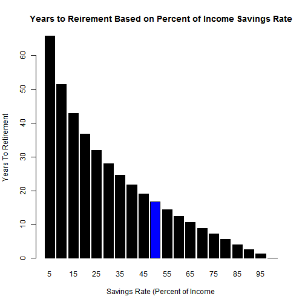

### Coursera Developing Data Products - Week 4 Project
## Time to Retirement Predictor

### by Paul Jefferies

--- .class #id 

## Are you tired of having to work and want get the point where you can choose to work or not...

## Would you like to have this choice in 7 years, 1 month and 20 days?

--- .class #id 

## Now you can decide when you get to make that choice based on your lifestyle choices now

--- .class #id 

## What are you waiting for?

Just follow the link and choose your destiny

<a href="https://pjefferies.shinyapps.io/retirementyearsbysavingsrate/">My Shiny - 'Time to Retirement' Application</a>

--- .class #id 

## References

<a href="https://networthify.com/calculator/earlyretirement">"Networthify - When can I retire?"</a>

<a href="http://www.mrmoneymustache.com/2012/01/13/the-shockingly-simple-math-behind-early-retirement/">Mr. Money Mustache - The Shockingly Simple Math Behind Early Retirement</a>

<a href='https://vimeo.com/183016901'>Mr. Money Mustache Explaining this Concept at WDS</a>
